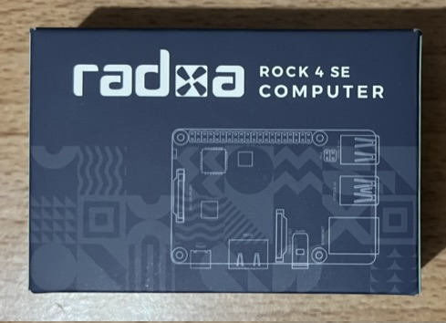
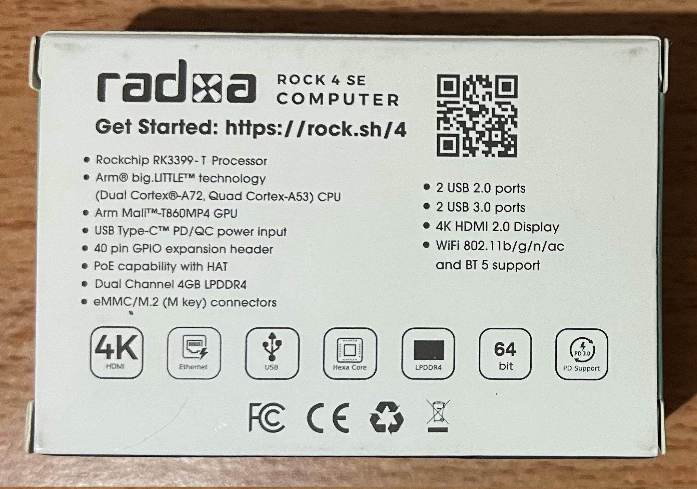
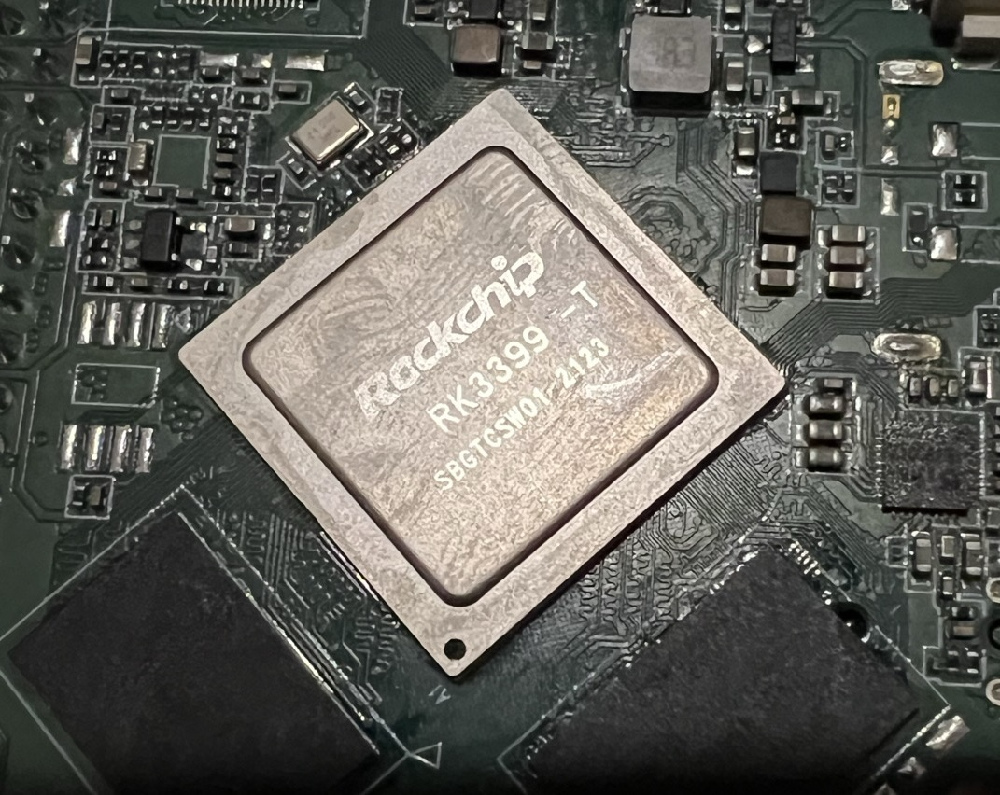
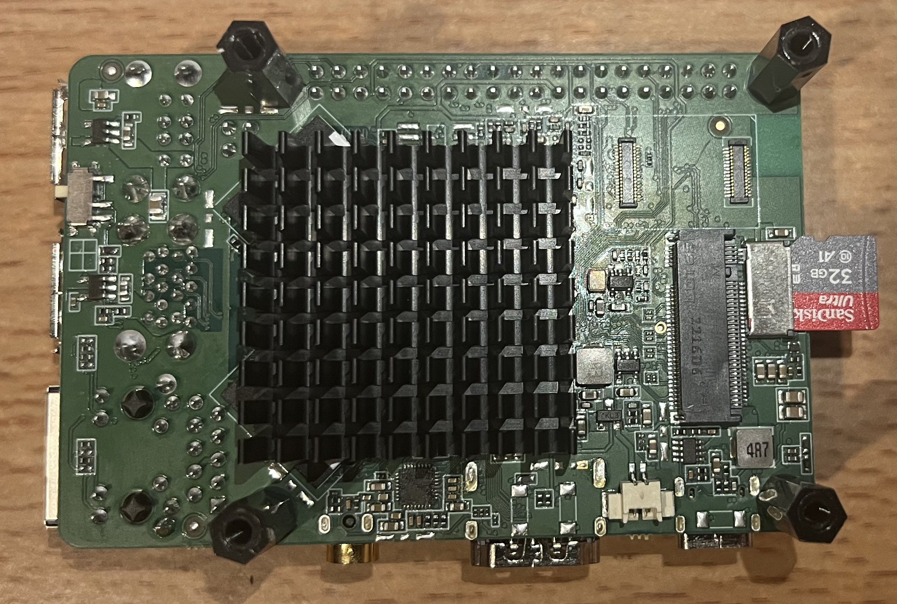

# Getting started

SBC is delivered in small package, just a little-bit larger than credit card.


Specifications can be found on the back of the package:


After unpacking I've noticed that chip is a bit dirty, ant there are traces of flux near RAM:


To keep processor cold I've installed radiator 35x35x10mm. I've also installed spacers:


Top side of PCB, memory card sticks out of the slot pretty far:


After standard procedure of writing Debian image(rockpi-4b-debian-bullseye-xfce4-arm64-20221109-1447-gpt.img.xz) to Micro Sd card using balenaEtcher I've connected periferals and connected power supply.

OS loaded without errors. But on login screen I've discovered that NuPhy Air75 keyboard doesn't work. After connecting another keyboard logged in without any issues.

### Peripherals used:

**Monitor:** 4k Samsung<br />
**Memory card:** SanDisk Ultra 32 GB<br />
**Power supply:** Anker USB C 40W, 521 Charger (Nano Pro)

**NOTE:** I've also tried couple other power supplies like Logiix 20W(USB-C + USB-A) and Vital 65W GaN 4 Port. SBC worked fine with both of them.

### Temperature

To check temperature:
```
cat /sys/class/thermal/thermal_zone0/temp
```

**Initial:** 54.4 °C<br />
**3 YouTube tabs:** 71.1 °C

### WiFi connection

In order to connect to WiFi I needed to enable it first:

```
sudo nmcli r wifi on
```

Then connect to WiFi:

```
sudo nmcli dev wifi connect "HomeWifi" password "NotForNeighbors"
```
