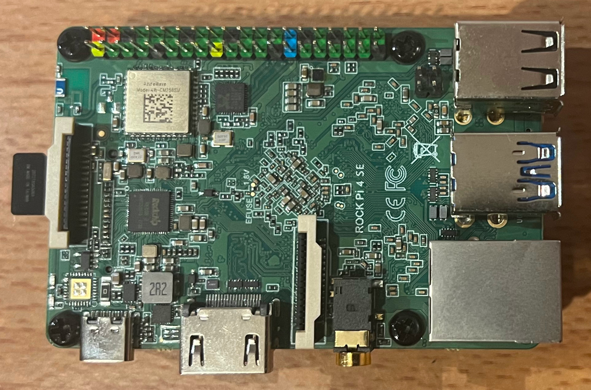

# ROCK 4 SE SBC

[1. Getting started](https://github.com/perehinik/rock_4_se_notes/tree/main/1_getting_started)
[2. Kernel module - Hello World](https://github.com/perehinik/rock_4_se_notes/tree/main/2_kernel_module_hello_world)
[3. Kernel module - GPIO driver](https://github.com/perehinik/rock_4_se_notes/tree/main/3_kernel_module_gpio_driver)
